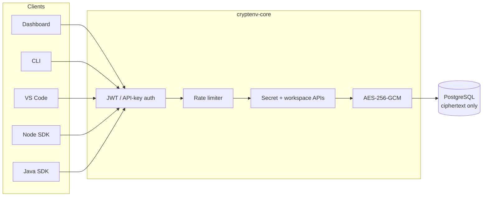
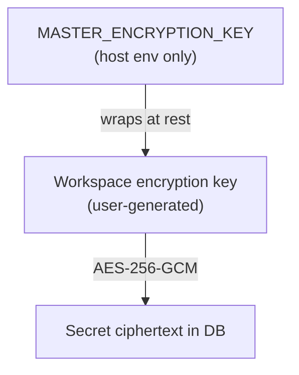
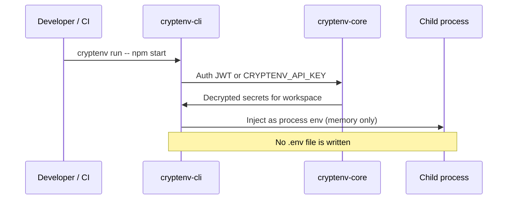
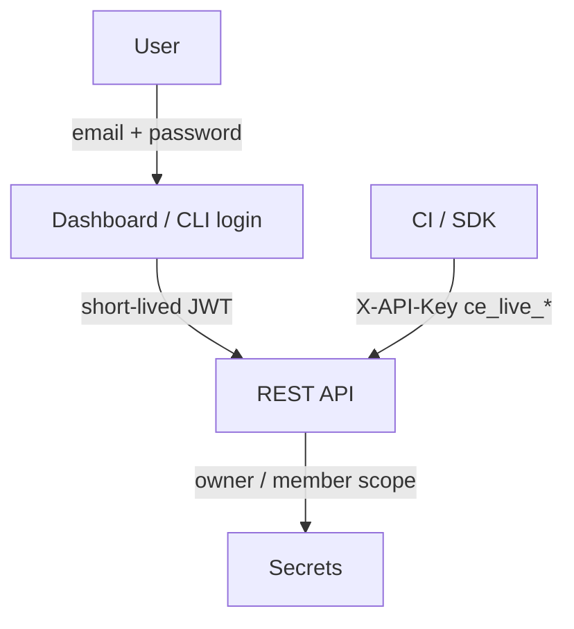

# CryptEnv

Encrypted environment secrets for local development, CI, and production — without committing `.env` files.

Secrets are stored as AES-256-GCM ciphertext, isolated by workspace and environment (`DEVELOPMENT` / `STAGING` / `PRODUCTION`), and injected at runtime through the dashboard, CLI, VS Code extension, or SDKs.

[](LICENSE)
[](https://www.npmjs.com/package/cryptenv-cli)
[](https://marketplace.visualstudio.com/items?itemName=maheshshinde9100.cryptenv)

## Live products

| Product | Link |
|---------|------|
| **Dashboard** | [cryptenv-dashboard.vercel.app](https://cryptenv-dashboard.vercel.app/) |
| **CLI (npm)** | [npmjs.com/package/cryptenv-cli](https://www.npmjs.com/package/cryptenv-cli) |
| **VS Code extension** | [CryptEnv - Secrets Manager](https://marketplace.visualstudio.com/items?itemName=maheshshinde9100.cryptenv) |
| **API** | `https://cryptenv-backend.onrender.com/api` |

---

## What it solves

Plaintext `.env` files leak through git history, screenshots, stolen laptops, and CI logs. CryptEnv keeps values in a vault, encrypts them per workspace, and injects them only into the process that needs them (`cryptenv run -- npm start`).

## Components

| Path | Role | Version |
|------|------|---------|
| `cryptenv-core/` | Spring Boot 3.2 API, PostgreSQL, Flyway, JWT + API keys, AES-256-GCM, rate limiting | Render deploy |
| `cryptenv-dashboard/` | React (Vite + Tailwind) vault UI, landing page, docs, audit | [Live](https://cryptenv-dashboard.vercel.app/) |
| `cryptenv-cli/` | Node CLI — workspaces, secrets, runtime injection | **1.3.0** |
| `cryptenv-vscode/` | Secrets Explorer, cursor insert, JWT / API key auth | **1.2.0** |
| `cryptenv-sdk/node/` | `@cryptenv/sdk` — fetch + optional client-side decrypt | 1.1.0 |
| `cryptenv-sdk/java/` | `com.maheshshinde:cryptenv-sdk` — API-key client | 1.1.0 |

---

## Architecture



### Encryption hierarchy



### Runtime injection (`cryptenv run`)



### Authentication



---

## Quick start

### 1. Use the hosted stack

1. Open the [dashboard](https://cryptenv-dashboard.vercel.app/) and create an account.
2. Create a workspace and set a workspace encryption key (min 16 characters).
3. Add an environment, then add secrets.
4. Copy your API key from **Settings**.

```bash
npm install -g cryptenv-cli
cryptenv --version
# cryptenv-cli 1.3.0

cryptenv login
cryptenv init
cryptenv secrets set DATABASE_URL "postgresql://localhost/app"
cryptenv run -- npm start
```

CI:

```bash
export CRYPTENV_API_KEY="ce_live_xxxxxxxx"
cryptenv run -- npm test
```

### 2. VS Code

Install [CryptEnv - Secrets Manager](https://marketplace.visualstudio.com/items?itemName=maheshshinde9100.cryptenv) (v1.2.0), sign in or paste an API key, then use the Secrets Explorer.

---

## Local development

**Prerequisites:** Java 17, Node.js 18+, Maven, PostgreSQL 16 (or Docker).

```bash
# Database
docker compose up -d postgres

# Backend — copy the example, then set env vars (never commit real secrets)
cd cryptenv-core
# Required: DB_URL, DB_USER, DB_PASS, JWT_SECRET, MASTER_ENCRYPTION_KEY
./mvnw spring-boot:run

# Dashboard
cd ../cryptenv-dashboard
npm install
npm run dev
# http://localhost:3000
```

CLI (local):

```bash
cd cryptenv-cli
npm install
npm link
cryptenv --version
```

Java SDK (local Maven):

```bash
cd cryptenv-sdk/java
mvn clean install
```

Config templates: `cryptenv-core/src/main/resources/application.properties.example`. Production secrets come from environment variables only.

---

## CLI reference (1.3.0)

| Command | Purpose |
|---------|---------|
| `cryptenv register` / `login` / `logout` / `profile` | Account |
| `cryptenv init` | Writes `.cryptenv.json` (API URL + workspace name — safe to commit) |
| `cryptenv workspaces ls` | List workspaces |
| `cryptenv workspaces create <name> -k <key>` | Create vault + encryption key |
| `cryptenv secrets ls \| get \| set \| delete` | Secret CRUD |
| `cryptenv run -- <cmd>` | Inject secrets into a child process |

Env: `CRYPTENV_API_URL`, `CRYPTENV_API_KEY`.

---

## Security notes

- Ciphertext at rest; plaintext is returned only to authenticated callers with workspace access.
- `/api/sdk/login` is public; other `/api/sdk/**` routes require auth.
- Per-IP rate limiting (Bucket4j) on API and stricter buckets on auth routes. `/api/health` is exempt.
- Test `application.properties` uses H2 placeholders — not production credentials.
- After rotating `MASTER_ENCRYPTION_KEY`, re-set each workspace encryption key.

---

## Repository layout

```
CryptEnv/
├── cryptenv-core/         Spring Boot API
├── cryptenv-dashboard/    React dashboard + landing page
├── cryptenv-cli/          npm CLI
├── cryptenv-vscode/       VS Code extension
├── cryptenv-sdk/node/     Node SDK
├── cryptenv-sdk/java/     Java SDK
└── docker-compose.yml     Local PostgreSQL
```

---

## License

MIT

---

## Developer

**Mahesh Shinde** — creator of CryptEnv (Spring Boot, React, CLI, VS Code, Java & Node SDKs).

- GitHub: [maheshshinde9100](https://github.com/maheshshinde9100)
- Repository: [github.com/maheshshinde9100/CryptEnv](https://github.com/maheshshinde9100/CryptEnv)
- Email: [maheshshinde9100@gmail.com](mailto:maheshshinde9100@gmail.com)
- Dashboard: [cryptenv-dashboard.vercel.app](https://cryptenv-dashboard.vercel.app/)
- npm: [cryptenv-cli](https://www.npmjs.com/package/cryptenv-cli)
- VS Code: [maheshshinde9100.cryptenv](https://marketplace.visualstudio.com/items?itemName=maheshshinde9100.cryptenv)
