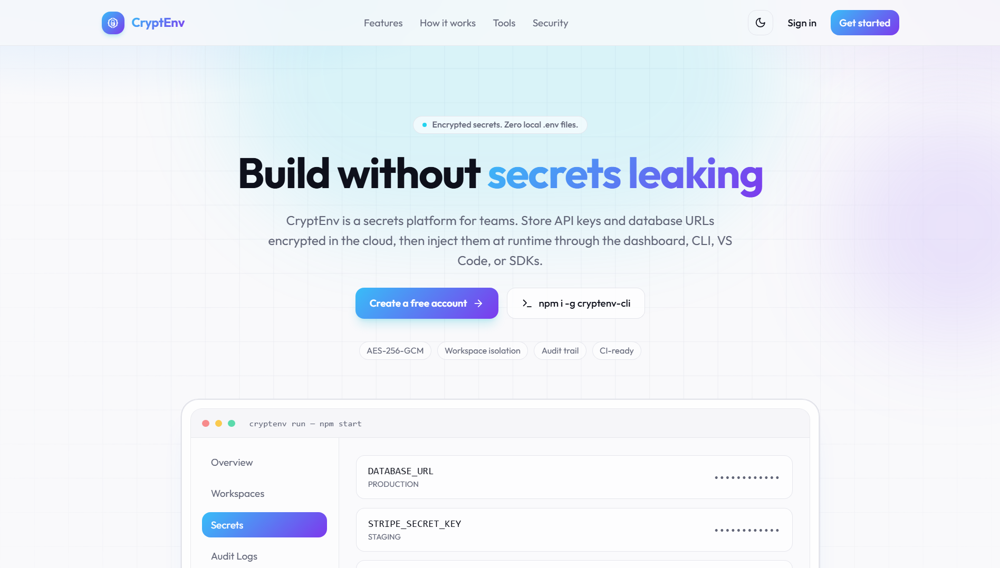
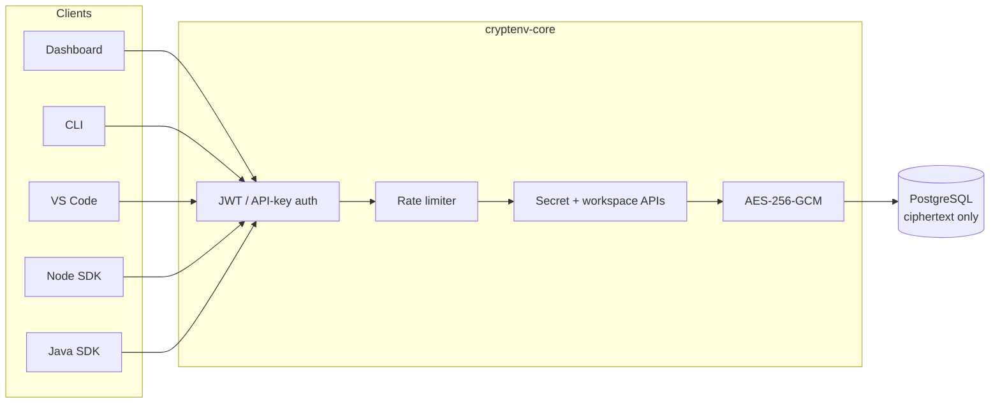
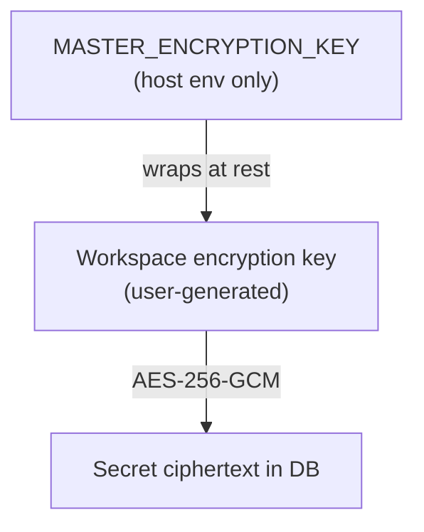
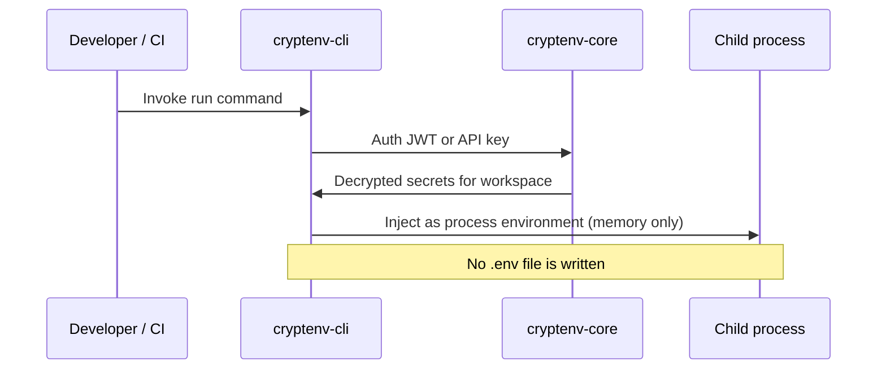
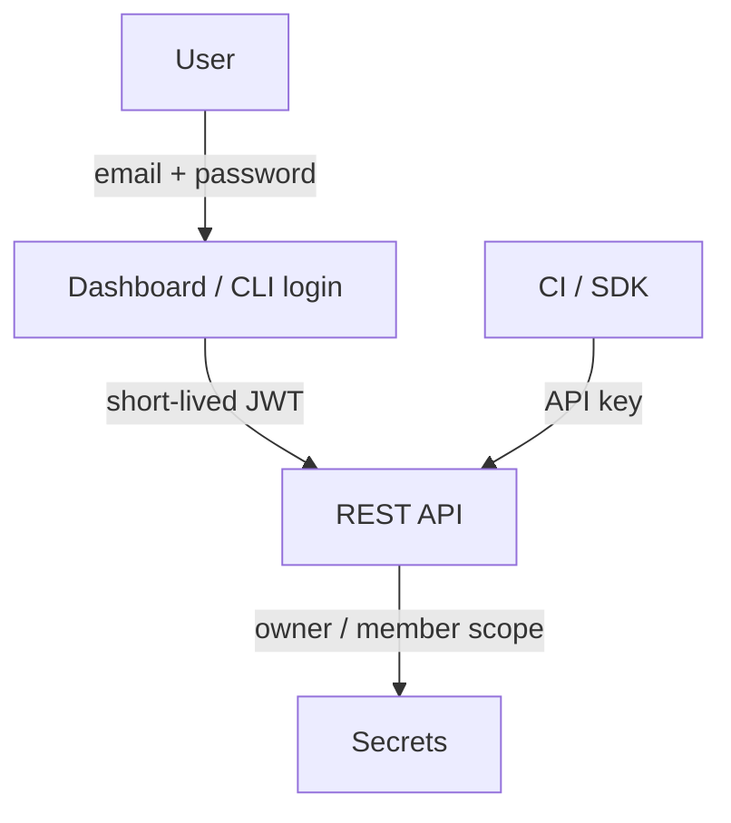

<div align="center">

# CryptEnv

**Encrypted environment secrets management for local development, CI, and production.**

Secrets are stored as AES-256-GCM ciphertext, isolated by workspace and environment (`DEVELOPMENT` / `STAGING` / `PRODUCTION`), and delivered at runtime through the dashboard, CLI, VS Code extension, or SDKs.

[](LICENSE)
[](https://www.npmjs.com/package/cryptenv-cli)
[](https://www.npmjs.com/package/cryptenv-sdk)
[&color=C71A36&logo=apachemaven)](https://central.sonatype.com/artifact/io.github.maheshshinde9100/cryptenv-sdk)
[](https://marketplace.visualstudio.com/items?itemName=maheshshinde9100.cryptenv)

[Dashboard](https://cryptenv-dashboard.vercel.app/) · [Repository](https://github.com/maheshshinde9100/CryptEnv) · [Report an Issue](https://github.com/maheshshinde9100/CryptEnv/issues)

</div>

---

## Preview

<div align="center">
  
  <p><em>CryptEnv Dashboard — landing page</em></p>
</div>

---

## Live Products

| Product | Link | Status |
|---|---|---|
| Dashboard | [cryptenv-dashboard.vercel.app](https://cryptenv-dashboard.vercel.app/) | Live |
| CLI (npm) | [npmjs.com/package/cryptenv-cli](https://www.npmjs.com/package/cryptenv-cli) | v1.3.0 |
| Node SDK (npm) | [npmjs.com/package/cryptenv-sdk](https://www.npmjs.com/package/cryptenv-sdk) | Live |
| Java SDK (Maven Central) | [central.sonatype.com/artifact/io.github.maheshshinde9100/cryptenv-sdk](https://central.sonatype.com/artifact/io.github.maheshshinde9100/cryptenv-sdk) | Live |
| VS Code Extension | [CryptEnv – Secrets Manager](https://marketplace.visualstudio.com/items?itemName=maheshshinde9100.cryptenv) | v1.2.0 |

---

## Overview

Plaintext `.env` files are a persistent source of leaks — through git history, screenshots, misconfigured CI logs, and shared machines. CryptEnv addresses this by storing every secret in an encrypted vault, scoping access per workspace and environment, and delivering values only to the authenticated process that requires them. No plaintext secret is ever written to disk.

---

## Components

| Path | Role | Version |
|---|---|---|
| `cryptenv-core/` | Spring Boot 3.2 API — PostgreSQL, Flyway, JWT and API-key auth, AES-256-GCM encryption, rate limiting | Render deployment |
| `cryptenv-dashboard/` | React (Vite + Tailwind) vault interface, landing page, documentation, audit log | [Live](https://cryptenv-dashboard.vercel.app/) |
| `cryptenv-cli/` | Command-line client for workspace, secret, and runtime-injection operations | 1.3.0 |
| `cryptenv-vscode/` | Secrets Explorer with JWT / API-key authentication | 1.2.0 |
| `cryptenv-sdk/node/` | [cryptenv-sdk](https://www.npmjs.com/package/cryptenv-sdk) — Node client with optional client-side decryption | 1.1.0 |
| `cryptenv-sdk/java/` | [io.github.maheshshinde9100:cryptenv-sdk](https://central.sonatype.com/artifact/io.github.maheshshinde9100/cryptenv-sdk) — Java client, published on Maven Central | 1.1.0 |

---

## Architecture



### Encryption Hierarchy



### Runtime Injection



### Authentication



---

## Access Points

CryptEnv can be used through any of the following, depending on workflow:

- The **dashboard**, for account setup, workspace and environment management, and secret administration.
- The **CLI**, for authenticating, managing workspaces, and injecting secrets into a running process without writing them to disk.
- The **VS Code extension**, for browsing and inserting secrets directly within the editor.
- The **Node and Java SDKs**, for programmatic retrieval of secrets from application code.

Full usage instructions for each client are maintained in the project documentation on the dashboard and in the respective package listings linked above.

---

## Security Notes

- Ciphertext is stored at rest; plaintext is returned only to authenticated callers with workspace access.
- Authentication routes are protected separately, with per-IP rate limiting applied across the API and stricter limits on authentication endpoints.
- Encryption keys follow a two-tier hierarchy: a host-level master key wraps per-workspace encryption keys, which in turn protect individual secrets.
- After rotating the master encryption key, each workspace encryption key must be re-set.

---

## Repository Layout

```
CryptEnv/
├── cryptenv-core/         Spring Boot API
├── cryptenv-dashboard/    React dashboard and landing page
├── cryptenv-cli/          Command-line client
├── cryptenv-vscode/       VS Code extension
├── cryptenv-sdk/node/     Node SDK
├── cryptenv-sdk/java/     Java SDK (Maven Central)
└── docker-compose.yml     Local PostgreSQL configuration
```

---

## License

Apache License 2.0 — see [LICENSE](LICENSE).

---

## Developer

**Mahesh Shinde** — creator of CryptEnv (Spring Boot, React, CLI, VS Code, Java and Node SDKs).

| | |
|---|---|
| Portfolio | [maheshshinde-dev.vercel.app](https://maheshshinde-dev.vercel.app) |
| LinkedIn | [linkedin.com/in/maheshshinde9100](https://linkedin.com/in/maheshshinde9100) |
| GitHub | [github.com/maheshshinde9100](https://github.com/maheshshinde9100) |
| Email | [maheshshinde9100@gmail.com](mailto:maheshshinde9100@gmail.com) |
| npm — CLI | [cryptenv-cli](https://www.npmjs.com/package/cryptenv-cli) |
| npm — SDK | [cryptenv-sdk](https://www.npmjs.com/package/cryptenv-sdk) |
| Maven Central | [cryptenv-sdk (Java)](https://central.sonatype.com/artifact/io.github.maheshshinde9100/cryptenv-sdk) |
| VS Code | [maheshshinde9100.cryptenv](https://marketplace.visualstudio.com/items?itemName=maheshshinde9100.cryptenv) |
| Dashboard | [cryptenv-dashboard.vercel.app](https://cryptenv-dashboard.vercel.app/) |
| Repository | [github.com/maheshshinde9100/CryptEnv](https://github.com/maheshshinde9100/CryptEnv) |
