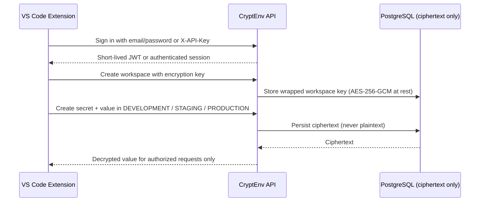

# CryptEnv - Secrets Manager for Visual Studio Code

<p align="center">
  
</p>

<p align="center">
  <strong>Editor-native AES-256-GCM encrypted vault for environment variables and API secrets.</strong>
</p>

<p align="center">
  <a href="https://marketplace.visualstudio.com/items?itemName=maheshshinde9100.cryptenv">
    
  </a>
  <a href="https://marketplace.visualstudio.com/items?itemName=maheshshinde9100.cryptenv">
    
  </a>
  <a href="https://github.com/maheshshinde9100/CryptEnv/blob/main/LICENSE">
    
  </a>
  <a href="https://cryptenv-dashboard.vercel.app/">
    
  </a>
</p>

<p align="center">
  <a href="https://marketplace.visualstudio.com/items?itemName=maheshshinde9100.cryptenv">Marketplace</a> &middot;
  <a href="https://cryptenv-dashboard.vercel.app/">Dashboard</a> &middot;
  <a href="https://github.com/maheshshinde9100/CryptEnv">Repository</a> &middot;
  <a href="https://github.com/maheshshinde9100/CryptEnv/issues">Report an Issue</a>
</p>

---

## Version 1.4.0

CryptEnv brings encrypted production, staging, and development secrets into VS Code. Sign in with email or an API key, create workspaces with per-workspace encryption keys, add environments, and manage key-value pairs without writing plaintext credentials to disk or source control.

The extension connects to the hosted CryptEnv API by default:

```
https://cryptenv-backend.onrender.com/api
```

Self-hosted deployments are supported via **CryptEnv: Set Backend URL**.

---

## Highlights

| Area | Capabilities |
| --- | --- |
| **Authentication** | Email + password (JWT), long-lived API keys, sign out, profile viewer, one-click API key regeneration. |
| **Workspaces** | Create, browse, and delete workspaces. Per-workspace AES encryption keys (16&ndash;512 characters). Visual indicator for workspaces missing a key. |
| **Environments** | DEVELOPMENT, STAGING, and PRODUCTION environments. Create and delete environments. |
| **Secrets** | Create, edit, preview, copy, insert, and delete encrypted key-value pairs. Values are masked in the tree and only revealed on-demand. |
| **Editor Workflow** | Insert a secret key or its decrypted value directly at the cursor from the right-click menu or command palette. |
| **Storage** | Credentials use VS Code SecretStorage. GlobalState stores only the backend URL and non-sensitive metadata. |
| **Connection** | Use the hosted CryptEnv backend, or configure a self-hosted root URL. The extension automatically normalises paths and appends `/api`. |

Secret values are transmitted over HTTPS to the CryptEnv API, encrypted at rest with AES-256-GCM, and returned only to authenticated requests that own the target workspace. The extension never writes a `.env` file.

---

## Quick Start

1. Install **CryptEnv - Secrets Manager** from the Marketplace, or install `cryptenv-1.4.0.vsix` with **Extensions: Install from VSIX...**.
2. Open the CryptEnv icon in the Activity Bar on the left.
3. Choose **Sign In**, or **Create Account** if you are new to CryptEnv. **Use API Key** is also available for CI-style tokens.
4. Once authenticated, click **Create Workspace**, enter a name, and provide a workspace encryption key. Store this key safely - it wraps every secret in the workspace and cannot be recovered.
5. Right-click the workspace and choose **Create Environment**, then select DEVELOPMENT, STAGING, or PRODUCTION.
6. Right-click the environment and select **Add Secret**. Enter a key (e.g. `DATABASE_URL`) and its value.
7. Click any secret to preview the decrypted value, copy it, or insert at the cursor.

The tree refreshes after every successful operation. Use the **Refresh Explorer** button at any time to re-sync from the server.

---

## Production Secret Workflow



The extension sends secret values only over HTTPS. Clicking a secret in the explorer fetches the latest value from the API and displays it inside a VS Code information modal. Values are always masked in the tree view until the user explicitly requests a preview, copy, or insert.

---

## Commands

All commands are available from the Command Palette (`Ctrl+Shift+P` / `Cmd+Shift+P`) and, where relevant, from the tree view title bar or item context (right-click) menus.

| Command | Purpose |
| --- | --- |
| `CryptEnv: Sign In` | Authenticate with email and password. The returned JWT is stored in SecretStorage. |
| `CryptEnv: Create Account` | Register a new CryptEnv account. You will be prompted to sign in afterwards. |
| `CryptEnv: Sign Out` | Clear the active JWT and API key from SecretStorage. |
| `CryptEnv: View Profile` | Display your email, username, and masked API key. Offers one-click regeneration. |
| `CryptEnv: Set API Key` | Authenticate using a long-lived API key. Supersedes any active JWT. |
| `CryptEnv: Set Backend URL` | Point the extension at a self-hosted CryptEnv deployment. The extension adds `/api` automatically. |
| `CryptEnv: Refresh Explorer` | Reload workspaces, environments, and secrets from the API. |
| `CryptEnv: Create Workspace` | Create a new workspace. Requires a 16&ndash;512 character encryption key. |
| `CryptEnv: Delete Workspace` | Permanently delete a workspace plus all of its environments and secrets. |
| `CryptEnv: Set Workspace Encryption Key` | Set or replace the AES key for an existing workspace. |
| `CryptEnv: Create Environment` | Add DEVELOPMENT, STAGING, or PRODUCTION to a workspace. |
| `CryptEnv: Delete Environment` | Permanently delete an environment and its secrets. |
| `CryptEnv: Add Secret` | Store an encrypted key-value pair in a specific environment. |
| `CryptEnv: Edit Secret` | Replace a secret value and optionally update its description. |
| `CryptEnv: Delete Secret` | Permanently remove a secret from its environment. |
| `CryptEnv: Preview Secret` | Reveal the decrypted value in a modal with Copy and Insert-at-cursor actions. |
| `CryptEnv: Copy Secret Value` | Copy the decrypted value to the system clipboard. |
| `CryptEnv: Insert Secret Key at Cursor` | Insert the key name (e.g. `DATABASE_URL`) into the active editor at the current selection. |
| `CryptEnv: Insert Secret Value at Cursor` | Insert the decrypted value into the active editor at the current selection. |

---

## Tree Context Menus

### Workspace Item
- Delete Workspace
- Set Workspace Encryption Key
- Create Environment

### Environment Item
- Delete Environment
- Add Secret

### Secret Item
- Preview Secret (eye icon, inline)
- Copy Secret Value (copy icon, inline)
- Insert Secret Key at Cursor
- Insert Secret Value at Cursor
- Edit Secret
- Delete Secret

---

## Security

- **Client storage.** Authentication tokens (JWT, API keys) use the VS Code [`SecretStorage`](https://code.visualstudio.com/api/references/vscode-api#SecretStorage) API, which is bound to the user's OS credential store and never written in plaintext to the workspace or extension folders.
- **Transport.** All API traffic uses HTTPS with the deployed TLS endpoint. Self-hosted deployments must use `http://` or `https://`; the extension rejects bare hostnames.
- **Encryption keys.** Each workspace requires a 16&ndash;512 character encryption key. The key is sent over HTTPS to the API, where it is wrapped by the host-level master key before being persisted. The workspace key is never returned by the API.
- **Ciphertext at rest.** Every secret is stored as AES-256-GCM ciphertext with a 12-byte random IV and 16-byte authentication tag.
- **Authorization scoping.** Reads, updates, and deletes are scoped to the owning workspace and environment. Identical keys in different environments are independent.
- **No `.env` output.** The extension never writes a `.env` file, project file, or workspace file containing plaintext secrets. Use the cursor-insert commands or the CLI/SDKs for runtime injection.
- **Audit-ready.** CryptEnv servers record workspace and secret access in audit logs (see the dashboard at [cryptenv-dashboard.vercel.app](https://cryptenv-dashboard.vercel.app/)).

---

## Requirements

- **Visual Studio Code** 1.85.0 or later.
- A CryptEnv account or API key. Create one directly from the extension with **CryptEnv: Create Account**, or on the [dashboard](https://cryptenv-dashboard.vercel.app/).
- Internet access to `https://cryptenv-backend.onrender.com/`, or a reachable self-hosted CryptEnv backend.

---

## Troubleshooting

| Symptom | Resolution |
| --- | --- |
| **Could not reach the CryptEnv backend** | Run **CryptEnv: Set Backend URL** and confirm the URL. For the hosted service, use `https://cryptenv-backend.onrender.com/`. |
| **Authentication failed / expired** | The error pop-up includes **Sign in again** and **Use API Key** actions. JWTs are short-lived; use an API key for long-lived sessions. |
| **Workspace is orange and says "needs encryption key"** | Right-click the workspace and choose **Set Workspace Encryption Key**. Secrets cannot be created until the key is configured. |
| **No values shown when previewing a secret** | Re-enter the workspace encryption key for the workspace, then create a new secret. Old secrets created with a different key are not recoverable. |
| **Commands are greyed out** | Open the CryptEnv explorer from the Activity Bar, or first run **CryptEnv: Sign In** or **CryptEnv: Set API Key**. |

Report additional issues at [github.com/maheshshinde9100/CryptEnv/issues](https://github.com/maheshshinde9100/CryptEnv/issues).

---

## Related CryptEnv Products

| Product | Link |
| --- | --- |
| Dashboard | [cryptenv-dashboard.vercel.app](https://cryptenv-dashboard.vercel.app/) |
| CLI (npm) | [cryptenv-cli](https://www.npmjs.com/package/cryptenv-cli) |
| Node SDK (npm) | [cryptenv-sdk](https://www.npmjs.com/package/cryptenv-sdk) |
| Java SDK (Maven Central) | [io.github.maheshshinde9100:cryptenv-sdk](https://central.sonatype.com/artifact/io.github.maheshshinde9100/cryptenv-sdk) |
| Core API (Spring Boot) | [github.com/maheshshinde9100/CryptEnv](https://github.com/maheshshinde9100/CryptEnv/tree/main/cryptenv-core) |

---

## Support

- Discussions & Q&A: [github.com/maheshshinde9100/CryptEnv/discussions](https://github.com/maheshshinde9100/CryptEnv/discussions)
- Issues: [github.com/maheshshinde9100/CryptEnv/issues](https://github.com/maheshshinde9100/CryptEnv/issues)
- Source code: [github.com/maheshshinde9100/CryptEnv/tree/main/cryptenv-vscode](https://github.com/maheshshinde9100/CryptEnv/tree/main/cryptenv-vscode)

---

MIT License &copy; Mahesh Shinde
